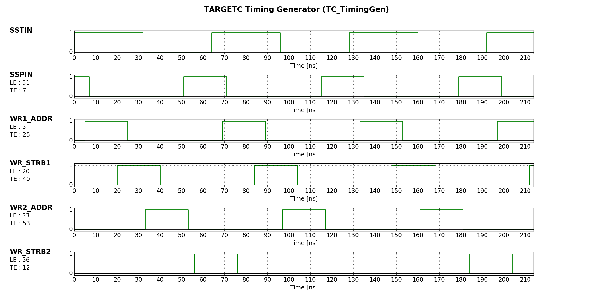

# Python

## Python 2.0
Contains the internal simulation of the Timing Generator from the TARGETC, [TC_TimingGenerator.py](Python_2.0/TC_TimingGenerator/TC_TimingGenerator.py)

## Python 3.5
Contains the scripts to launch the GUI application
